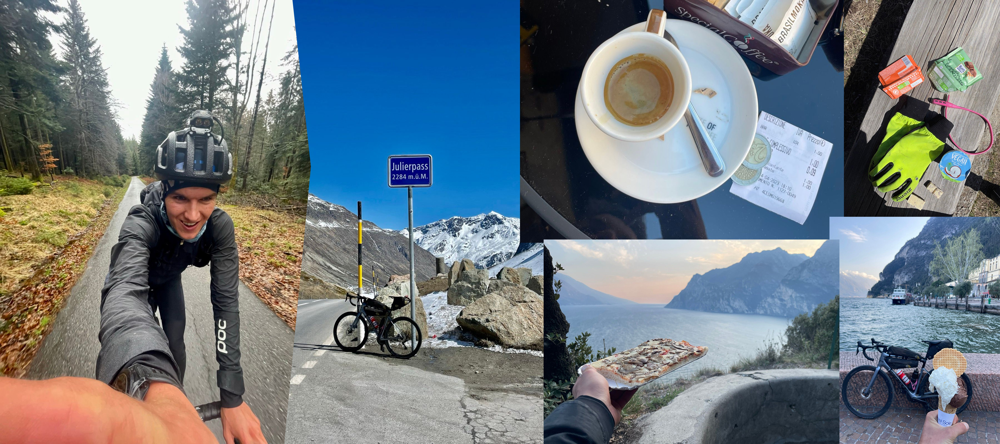

# Die Idee
Geplant war von Pforzheim nach Rom zu radln. Leider liegt Rom doch etwas zu weit im Süden für einen Kurztrip, weshalb eine Alternative her musste. So wurde es eine Runde durch die Alpen.

# Die Route
```{r projects, echo=FALSE}
library(leaflet)
library(sp)
library(sf)
library(rgdal)
library(rprojroot)

## get gpx track
tag1 <- readOGR(paste0(getwd(), "/tag1.gpx"), layer = "tracks", verbose = FALSE)
tag2 <- readOGR(paste0(getwd(), "/tag2.gpx"), layer = "tracks", verbose = FALSE)
tag3 <- readOGR(paste0(getwd(), "/tag3.gpx"), layer = "tracks", verbose = FALSE)
tag4 <- readOGR(paste0(getwd(), "/tag4.gpx"), layer = "tracks", verbose = FALSE)
tag5 <- readOGR(paste0(getwd(), "/tag5.gpx"), layer = "tracks", verbose = FALSE)

# add gpx tracks
leaflet() %>%
  # add gpx tracks
  addPolylines(data=tag1, color = "red", label = "Tag 1; Pforzheim - Freiburg") %>%
  addPolylines(data=tag2, color = "blue", label = "Tag 2: Freiburg - Niederurnen") %>%
  addPolylines(data=tag3, color = "green", label = "Tag 3: Niederurnen - Lago di Como") %>%
  addPolylines(data=tag4, color = "purple", label = "Tag 5: Lago di Como - Lago di Garda") %>%
  addPolylines(data=tag5, color = "yellow", label = "Tag 6: fast heim") %>%


  # add special points

  addTiles() # Add default OpenStreetMap map tiles

# mehr infos: https://rstudio-pubs-static.s3.amazonaws.com/328775_2c54adb6ac734563b88c14bce515b012.html

```
# Zusammenfassung

### Tag 1: Heute nach dem Sinn gesucht
> `r fontawesome::fa("flag-checkered", height = "12px")` Pforzheim - Freiburg - `r fontawesome::fa("road", height = "12px")` 185 km - `r fontawesome::fa("mountain", height = "12px")` 2700 hm 

- und Gummibärchen an der Tanke gefunden 🤝
- hätte Strava ne Niederschlagskarte wäre die heute größtenteils Blau. Die Regenwolke über mir hat sogar gewartet, als ich Kaffee getrunken hab.
- 10/10 would recommend
- Landschaftsbilder gibts nicht, weil eh nur Wolken 🤷‍♂️

### Tag 2: heute trocken 😍
> `r fontawesome::fa("flag-checkered", height = "12px")` Freiburg - Niederurnen - `r fontawesome::fa("road", height = "12px")` 195 km - `r fontawesome::fa("mountain", height = "12px")` 2750 hm 

dafür nie mehr als 5 grad, hauptsächlich Gegenwind, Anschiss von Waldarbeitern (selbstverschuldet), Radwege, die einem Miniaturalpencross gleich kamen, 20€ für ne Pizza, unfassbar viele rote Ampeln. Sonst noch was?
- Ach ja: Die letzten 10 Km Rückenwind. Natürlich war die Schaltung leer. Wie ich da über die Landstraße gestrampelt bin muss lustig ausgesehen haben
- 10/10 would recommend 🤗
- Und noch ein ❤️ an die Warmshowers Community.

### Tag 3: Langsam aushaltbar
> `r fontawesome::fa("flag-checkered", height = "12px")` Niederurnen - Lago di Como - `r fontawesome::fa("road", height = "12px")` 206 km - `r fontawesome::fa("mountain", height = "12px")` 3000 hm 

ab nach bella Italia - via Lenzerheide, Julierpass & (ohne es zu merken) Malojapass
- Espresso 1€ -> alle Strapazen entlohnt.
- Erster Tag, ohne zu frieren.
- Julierpass ohne Frage was besonderes. Ewig lange & mega abwechslungsreiche Auffahrt durch verschlafene Dörfer und beeindruckenden Gletschern.
- Wind aus allen Richtungen. Am Anfang noch von vorne, dann nur mehr von hinten und bergab dann noch volle Breitseite (abenteuerlich)
- Autofahrerkudos 2023: 9 (+3)
Schönheit der Landschaft möglicherweise kausal für Freundlichkeit deutscher SUV Fahrer? Evtl. Höhe ü.N. als endogener Faktor, da ein Sauerstoffmangel im Gehirn dafür sorgt, dass auf die Straße konzentrieren UND pöbeln unmöglich wird - nur so ein Gedanke 🙈
- 10/10 would recommend

### Tag 4: viele Wege führen nach Rom, am Ende stehste trotzdem am Gardasee
> `r fontawesome::fa("flag-checkered", height = "12px")` Lago di Como - Riwa - `r fontawesome::fa("road", height = "12px")` 220 km - `r fontawesome::fa("mountain", height = "12px")` 1600 hm 

- schwer zu sagen, was heikler war. Auf m Rad durch den Nationalpark in Uganda oder der Italienische Verkehr heute. Jedenfalls war Augen zu und vollgas durch sicherer, als Verkehrsregeln zu beachten.
- Shoutout an den tapferen Kollegen, der 20km (Gegen)Windschatten gespendet hat, ohne auch nur einmal den Gang zu wechseln.
- An der Eisdiele meinte einer noch "cooles Fahrrad". Wenn ich so drüber nachdenke ist das wohl das schlimmste Komplement, was geht

### Tag 5: Italien overload
> `r fontawesome::fa("flag-checkered", height = "12px")` Riwa - Lawis - `r fontawesome::fa("road", height = "12px")` 85 km - `r fontawesome::fa("mountain", height = "12px")` 1750 hm 

- nicht die KI, sondern selbstreinigende Klos sind die größte Bedrohung unserer Zeit. Erst geht die Tür ständig auf und zu und dann startet das Ding einfach me Generalreinigung, als ich noch drin war. Rückgeld gabs auch keins🙄
- am Bahnhof ist dann solange ein Zug vorbeigedonnert, bis mein ausgebautes und an die Wand angelehntes Laufrad sich verselbstständigt hat und Richtung Güterzug gerollt isg. Der rettende Hechtsprung (Es haben noch so 30cm gefehlt) wurde mit ner blutenden Hand belohnt. Kann man sich nicht ausdenken.
- Ansonsten müde Beine 🤓
- Heimreise mit Fahrradtasche. Mal schauen, ob ich ohne Extraticket bis heim komme. Danke aber Marius Schada für die Empfehlung 🥳