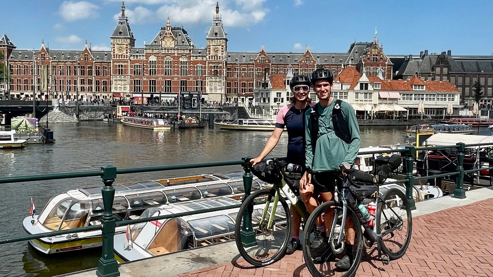
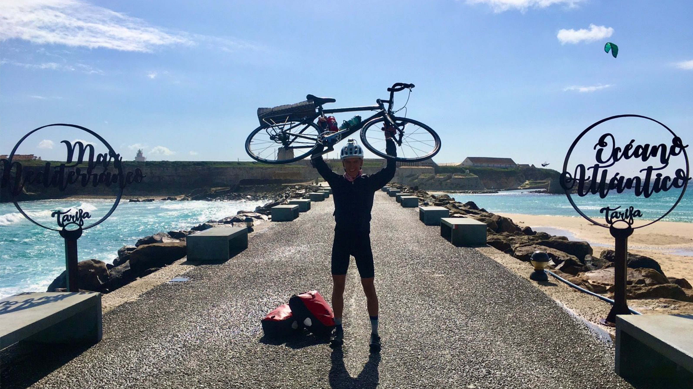

```{r , echo=FALSE}
# load packages for carousel
library(rprojroot)
library(slickR)
```

Bikepacking. Was gibts schöneres als Radlfahren, Essen und unbekannte Gegenden erkunden? Richtig: Alles auf einmal machen. 

____

# Süd-Ost Uganda

<p style="text-align: center;">`r fontawesome::fa("calendar-days", height = "12px")` 13.02.2023 - `r fontawesome::fa("clock", height = "12px")` 7 Tage - `r fontawesome::fa("flag-checkered", height = "12px")` Kigali - Fort Portal - `r fontawesome::fa("road", height = "12px")` 461 km - `r fontawesome::fa("mountain", height = "12px")` 5.500 hm </p>
 
Gerade erholt vom Race around Rwanda ging es nochmal los  mit dem Wunsch "bloß keine Hügel mehr". Es sollte noch der ein oder andere Hügel kommen, bis ich vor den Weiten des Queen Victoria National Parks stehen sollte. Doch dort gab's nicht nur viel Flachland, sondern auch Elefanten zu bestaunen. [Hier gehts zur ganzen Geschichte](https://soeren-schwabbauer.github.io/blog/bikepacking/2023-02-13-uganda/)


___

# Race around Rwanda
<p style="text-align: center;">`r fontawesome::fa("calendar-days", height = "12px")` 05.02.2023 - `r fontawesome::fa("clock", height = "12px")` 83 h - `r fontawesome::fa("flag-checkered", height = "12px")` Rwanda - `r fontawesome::fa("road", height = "12px")` 1.000 km - `r fontawesome::fa("mountain", height = "12px")` 17.500 hm </p>
 
1000 Kilometer einmal um das Land der 1000 Hügel.  Ein self-supported Bikepacking Race, bei dem man nie alleine ist. 1000 Eindrücke und Geschichten. Hier kommen ein paar davon. Lust auf mehr? [Hier gehts zur ganzen Geschichte](https://soeren-schwabbauer.github.io/blog/bikepacking/2023-03-14-race-around-rwanda/)

```{r , echo=FALSE}

path_rar <- list.files(path = paste0(find_rstudio_root_file(), "/images/bikepacking_rar/"), full.names = TRUE)

slickR(obj = path_rar , width = "95%") + 
  settings(autoplay = TRUE)

```

____

# Innsbruck - Athen. Ende der Storyline
 <p style="text-align: center;">`r fontawesome::fa("calendar-days", height = "12px")` 20.08.2022 - `r fontawesome::fa("clock", height = "12px")` 9 Tage - `r fontawesome::fa("flag-checkered", height = "12px")` Innsbruck - Athen - `r fontawesome::fa("road", height = "12px")` 2.200 km - `r fontawesome::fa("mountain", height = "12px")` 22.000 hm </p>
 
Von Innsbruck im Turbomodus nach Athen. Entlang der Adria auf der Suche nach dem besten Café Fredo Griechenlands.


___

# Eskarparten
 <p style="text-align: center;">`r fontawesome::fa("calendar-days", height = "12px")` 25.07.2022 - `r fontawesome::fa("clock", height = "12px")` 10 Tage - `r fontawesome::fa("flag-checkered", height = "12px")` Kaparten - `r fontawesome::fa("road", height = "12px")` 1.800 km - `r fontawesome::fa("mountain", height = "12px")` 18.000 hm </p>

In Wien gestartet, ging es über Ungarn rein in die rumänischen Kaparten. Endlose Weiten, viel Langos, Hunde und Bären. Eine Reise durch eine ganz andere Ecke Europas, wie sie seinesgleichen sucht. Lust auf mehr? 


___

# Let's fiets to Amsterdam
 <p style="text-align: center;">`r fontawesome::fa("calendar-days", height = "12px")` 15.07.2022 - `r fontawesome::fa("clock", height = "12px")` 9 Tage - `r fontawesome::fa("flag-checkered", height = "12px")` Innsbruck - Amsterdam - `r fontawesome::fa("road", height = "12px")` 1.270 km - `r fontawesome::fa("mountain", height = "12px")` 7.500 hm </p>

Von Innsbruck ab nach Amsterdam. Entlang des Bodensees und durch den Schwarzwald weiter nach Freiburg. An den heißesten Tagen des Jahres durch Strasburg und weiter nach Luxemburg und Belgien. Dann noch gegen den Gegenwind an der Küste gekämpft und schon warn ma da.



___

# Im Winter ins Warme
 <p style="text-align: center;">`r fontawesome::fa("calendar-days", height = "12px")` 18.02.2022 - `r fontawesome::fa("clock", height = "12px")` 12 Tage - `r fontawesome::fa("flag-checkered", height = "12px")` Innsbruck - Tarifa - `r fontawesome::fa("road", height = "12px")` 2.500 km - `r fontawesome::fa("mountain", height = "12px")` 23.000 hm </p>

Nach 5 Klausuren in 5 Tagen nur noch weg. Nach dem überaschenderweise durchaus warmen Überqueren des Arlbergpasses gabs eigentlich kein Halten mehr. Ab durch die Schweiz, Baguette und Oliven in Fankreich und spätestens ab den Pyrenäen nur noch in kurz-kurz. Nachdem ich den Verkehrswahnsinn in Barcelona überlebt habe, ging es entlang der malerischen Spanischen Küste bis an den südlichsten Punkt Europas: Tarfia.


___

# Im Winter ins Warme
 <p style="text-align: center;">`r fontawesome::fa("calendar-days", height = "12px")` 18.02.2022 - `r fontawesome::fa("clock", height = "12px")` 12 Tage - `r fontawesome::fa("flag-checkered", height = "12px")` Innsbruck - Tarifa - `r fontawesome::fa("road", height = "12px")` 2.500 km - `r fontawesome::fa("mountain", height = "12px")` 23.000 hm </p>

Nach 5 Klausuren in 5 Tagen nur noch weg. Nach dem überaschenderweise durchaus warmen Überqueren des Arlbergpasses gabs eigentlich kein Halten mehr. Ab durch die Schweiz, Baguette und Oliven in Fankreich und spätestens ab den Pyrenäen nur noch in kurz-kurz. Nachdem ich den Verkehrswahnsinn in Barcelona überlebt habe, ging es entlang der malerischen Spanischen Küste bis an den südlichsten Punkt Europas: Tarfia.

![](images/bikepacking_tarifa/tarifa.jpg
