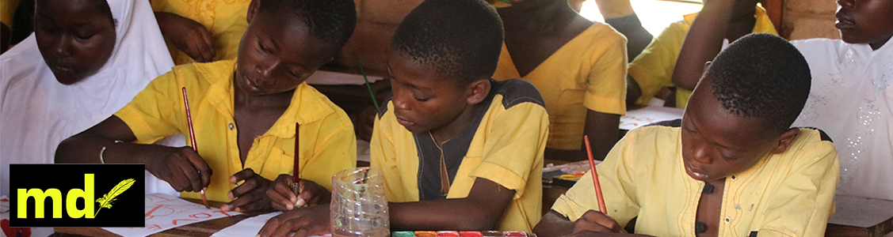
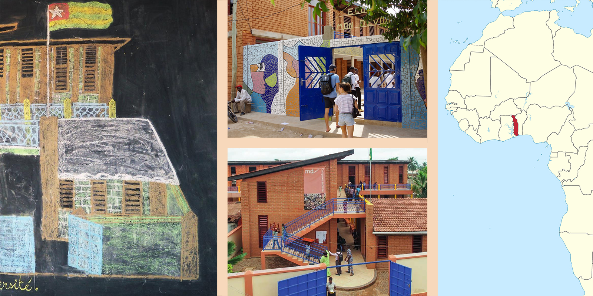

## Spendenstand
```{r, echo = FALSE}
library(googlesheets4)
library(dplyr)

df <- read_sheet("https://docs.google.com/spreadsheets/d/1SkRcqCT_gsIfMK-wWC-oI9BECuhq7rVdp8s4UyWNM5M/edit?resourcekey#gid=1592088680")

sum_pauschalbetrag <- sum(df$`Als Pauschalbetrag, unabhängig vom Erreichen der Zugspitze, spende ich ...€`, df$`Zu Beginn spende ich ...€`, na.rm = TRUE)

sum_finish <- sum(df$`Erst bei Erreichen der Zugspitze spende ich ...€`, df$`Als Pauschalbetrag, unabhängig vom Erreichen der Zugspitze, spende ich ...€`, df$`Beim Erreichen der Zugspitze stocke ich diesen Betrag auf einen Gesamtbetrag von ...€ auf.`, na.rm = TRUE)

time <- format(Sys.time(), format="%d. %B, %H:%M Uhr")
```

<b> Bisher wurde $`r sum_pauschalbetrag`$ $Euro$ unabhängig vom Erreichen der Zugspitze gespendet.

Wenn ich es schaffe, vom tiefsten Punkt Deutschlands zum Höchsten zu kommen, werden insgesamt $`r sum_finish`$ $Euro$ gespendet. 

Das sind $`r sum_finish/60`$ $Jahre$ Schulbildung für Kinder aus sozial schwachen Familien, die sonst keinen Zugang zu guter Bildung hätten. </b>
<div style="text-align: right">  (Stand: `r time`) </i>  </div>
<br>


# Mein Ziel & ich
Für die, die mich nicht kennen: Hey, ich bin Sören, 22 Jahre alt & leidenschaftlicher Ausdauersportler. Nachdem ich im vergangenen Jahr Bergläufe jenseits der 42km bestritten habe, habe ich mittlerweile meine Leidenschaft im Bikepacking gefunden. <br>
Mein Ziel ist es, am <u>9. Juni </U>, <u>self-supported</u>$^1$ & <u>schnellstmöglich</u> vom tiefsten Punkt Deutschlands zum Höchsten zu gelangen. Anders gesagt: von Neuendorf-Sachsenbande (nördlich von Hamburg) auf die Zugspitze. Die selbstgeplante 922 Kilometer (mit 7.200 Höhenmetern) lange Radstrecke führt mich durch 5 Bundesländer und endet an der Reintalangerhütte im Partnachtal bei Garmisch-Patenkirchen. Von dort trennen mich noch 6 Kilometer Fußmarsch (mit 1.500 Höhenmetern) von Deutschlands höchstem Gipfel.

<aside> $^1$ self-supported heißt dabei aus eigenem Antrieb und ohne fremde Hilfe. Alles, was ich zum Erreichen des Ziels benötige, werde ich von Anfang an mitnehmen (also auf die Laufschuhe für den finalen Aufstieg). Unterwegs werde ich mich selbst versorgen. Note: zur eigenen Sicherheit werde ich auf den letzten Laufkilometern begleitet.
</aside>


### Meine Motivation
Bildung ist leider bei Weitem keine Selbstverständlichkeit. Im Rahmen dieser sportlichen Herausforderung möchte ich auf das Schulprojekt "Mon Devoir" im Togo (Westafrika) aufmerksam machen. <b> Die Schule bietet einen Stipendienfonds für Kinder aus sozial-schwachen Familien, um jedem Kind eine Chance auf Bildung zu ermöglichen.</b> Damit die laufende Kosten gedeckt werden können, fallen im Schnitt <b> 30 € pro Halbjahr pro Kind an </b>. Für diesem Fond möchte ich Spenden sammeln und ich würde mich riesig freuen, wenn du mich dabei unterstützt.

Auf die Schule "Mon Devoir" und den gleichnamigen Freiburger Verein, der die Schule unterstützt, bin ich auf einer Reise in den Togo nach dem Abitur/der Matura gestoßen. Mich begeistert dabei besonders das freiwillige Engagement, mit dem sich Mitglieder und Ehrenamtliche engagieren. Durch den regelmäßigen Kontakt zum Vorstand, sowie aktiven Mitgliedern im Verein, vertraue ich darauf, dass das gespendete Geld zu in <b> voller Höhe </b> dort eingesetzt wird, wo es verwendet werden soll.


### Die Strecke
```{r projects, echo=FALSE}
library(leaflet)
library(sp)
library(sf)
library(rgdal)
library(rprojroot)

## get gpx track
bike <- readOGR(paste0(getwd(), "/images/spendenaktion/bike.gpx"), layer = "tracks", verbose = FALSE)
run <- readOGR(paste0(getwd(), "/images/spendenaktion/run.gpx"), layer = "tracks", verbose = FALSE)

## map track
leaflet(width=2000) %>% 
  
  # add gpx tracks
  addPolylines(data=bike, color = "red", label = "920km Radfahrt; Neuendorf - Reintalangerhütte") %>%
  addPolylines(data=run, color = "blue", label = "5km Lauf zur Zugspitze") %>%

  addMarkers(lat = 53.9633267, lng = 9.3158384, popup = "Tiefste Stelle Deutschlands", label = "Tiefste Stelle Deutschlands") %>%
  addMarkers(lat = 47.4210795, lng = 10.975044, popup = "Zugspitze", label = "Zugspitze") %>%
  
  addTiles() # Add default OpenStreetMap map tiles

# mehr infos: https://rstudio-pubs-static.s3.amazonaws.com/328775_2c54adb6ac734563b88c14bce515b012.html

```

# Interesse geweckt?
Ich freue mich über jede Form der Unterstützung und möchte mich jetzt schonmal für dein Interesse bedanken. Falls du noch offene Fragen hast, melde dich gerne bei mir via [E-Mail](mailto:soeren@schwabbauer.de). Für interessierte Spender würde ich eine Whatsapp Gruppe erstellen. Dort werde ich Updates von Unterwegs, sowie dem Spendenstand teilen <i>(Bitte Kontaktinformation im Spendenformular angeben)</i>.

Wer noch mehr Informationen über den Togo, die Schule oder den Verein möchte, kann [hier](https://soeren-schwabbauer.github.io/blog/spendenaktion.html#weitere-informationen-%C3%BCber-das-land-die-schule) noch etwas weiterlesen oder sich gerne [hier](https://www.mon-devoir.de/) auf der Homepage der Schule etwas umschauen.


>  <u>Spendenkonto:</u> <br>
&ensp;&thinsp;&ensp;&thinsp; Mon Devoir e.V. <br>
&ensp;&thinsp;&ensp;&thinsp; Verwendungszweck: Zugspitze <br>
&ensp;&thinsp;&ensp;&thinsp; BIC: GENODE61FR1 <br>
&ensp;&thinsp;&ensp;&thinsp; IBAN: DE91 6809 0000 0025 3991 02 <br>
<i>Das Ausstellen einer Spendenbescheinigung ist möglich. Hierfür bitte eine E-Mail-Adresse im Formular angeben.</i>

<b> Um einen Überblick über den Spendenstand zu bekommen würde ich mich freuen, wenn du noch kurz dieses Spendenformular ausfüllen könntest. Ich freue mich aber natürlich auch über namenlose Spenden!! </b>

<iframe src="https://docs.google.com/forms/d/e/1FAIpQLSd2w_MdyuJ03ciN__Pcdi56HoCn0U001RJt3WnPXLWP80Teew/viewform?embedded=true" width="640" height="518" frameborder="0" marginheight="0" marginwidth="0">Wird geladen…</iframe>

# Weitere Informationen über das Land & die Schule

### Das Land Togo & die Stadt Aogé
Togo ist eines der ärmsten und kleinsten Ländern Afrikas. Im Westen grenzt es an Ghana und im Osten an Benin. Von den rund 8,2 Millionen Einwohnern sind 59% unter 25 Jahre. 

Von 1904 bis 1914 war das Land eine Deutsche Kolonie. Bis 1960 wurde das Land von Frankreich verwaltet. Von dort an litt das Land fast 40 Jahre lang unter der Alleinherrschaft und Militärdiktatur des ersten Präsidenten. Seit 2002 gilt Togo als eine präsidentielle Demokratie.

Viele Jahre lang legte die Regierung keinerlei Wert auf den Ausbau der Bildung. Die Lehrerbildungsstätten wurden aus Geldmangel geschlossen. Für alle Schulen musste Schulgeld bezahlt werden. Erst seit einigen Jahren ist zumindest der Besuch der 6-jährigen Grundschule kostenlos. Allerdings gibt es nach wie vor keine Lernmittelfreiheit und keine kostenlosen weiterführenden Schulen. In vielen Klassen werden mehr als 70 Schülerinnen und Schüler unterrichtet.

Die Schule selbst liegt in Zongo. Zogo ist ein Stadtteil von Agoé, einer schnell wachsenden Stadt an der nördlichen Peripherie von Lomé. Zongo liegt abseits vom Stadtkern in einem sumpfigen Gebiet. In diesem Stadtteil leben überwiegend muslimische Familien. Viele Menschen sind in den letzten Jahren zugewandert aus dem Norden Togos und aus den unruhigen Staaten der Region. Die Zahl der Menschen, vor allem Frauen, die nicht Französisch spricht und nie eine Schule besucht hat, ist in Zongo größer als im Rest von Togo. Viele der Häuser haben keinen Zugang zu Strom und fließendem Wasser. Eine regelmäßige öffentliche Verkehrsverbindung nach Lomé gibt es nicht. Eine geregelte Müllabfuhr steckt noch in zarten Anfängen. Die meisten Menschen in Zongo haben keine feste Anstellung und arbeiten im informellen Bereich. Zongo wird von der großen, vierspurigen Nationalstraße nach Norden zweigeteilt. Fußgängerbrücken gibt es nicht und Ampeln sind selten. Direkt an der Straße, gegenüber der Schule befindet sich der "Port du Sahel", Teil des Hafens von Lomé, wo mit Gebrauchtwaren aller Art gehandelt wird und LKWs auf ihre Ladetermine am Hafen  warten. Es gibt in Agoé staatliche Grundschulen, ein weiteres privates Collége und Gymnasium sowie ein großes islamisches Schulzentrum, finanziert von Saudi-Arabien. Die Zahl der Kinder in den Familien ist in Zongo sehr hoch. Da viele Erwachsene Arbeit in Nachbarländern oder den Golfstaaten suchen, gibt es auch eine große Zahl Alleinerziehender. 



### Die Schule und der Verein "Mon Devoir"
Die Schule wurde 1997 als Grundschule von Mamane Awal Bida (1953-2012) gegründet. Möglich wurde dies durch die finanzielle Unterstützung von Frau Dr. Elisabeth Scharpff (1920-2014). Beide hatten sich in Hamburg kennengelernt, wo Monsieur Bida einige Jahre gelebt hat. Frau Dr. Scharpff unterstützte die Schule noch viele Jahre und stattete ihr auch selbst einen Besuch ab. Von Beginn an war Mon Devoir eine laizistische Schule, in der Mädchen und Jungen gleich welcher Religionszugehörigkeit unterrichtet wurden. 2007 gründete der Neffe von Frau Dr. Scharpff, Dr. Jörg Scharpff auf Wunsch seiner Tante in Freiburg den Förderverein Mon Devoir e.V. Er hat die Renovierung der Grundschule, Ausbau und Weiterentwicklung der Schule seither entscheidend vorangetrieben. Heute wird die Schule von etwa 1000 Kindern und Jugendlichen besucht.

Auszug aus dem Leitbild der Schule 
- Gleiche Chancen für alle Kinder, unabhängig von Geschlecht, Religion oder Herkunft 
- Gleiche Chancen auf Einstellung und Gleichbehandlung aller Mitglieder des Kollegiums, gleich welchen Geschlechts, welcher Religion, welcher politischen Einstellung oder welcher Herkunft 
- Erziehung der Kinder und Jugendlichen zu Toleranz und Respekt 
- Gewaltfreier, respektvoller Umgang aller am Schulleben beteiligten Personen miteinander 
- Förderung des Verantwortungsbewusstseins für die Schule, den Ort und die Umwelt 
- Förderung benachteiligter Kinder 
- Qualifizierter, regelmäßiger Unterricht 
- Maximal 40 Kinder in einer Klasse (In Togo sind 80 oder mehr Kinder in einer Klasse keine Seltenheit.) 
- Gründliche Vorbereitung der Klassen auf die staatlichen Prüfungen 
- Der Förderverein behält sich vor, die Förderung der Schule einzustellen oder zu unterbrechen, wenn die Umsetzung der Ideen des Leitbildes und der Inhalte der Schulordnung im Schulalltag nicht gewährleistet ist. Gleiches gilt, wenn die halbjährlichen Finanzberichte nicht rechtzeitig vorliegen oder deren Inhalt nicht nachvollziehbar ist. 


### Die Schüler der Schule
Im Kindergarten werden in drei Gruppen zwischen ca. 80 Kinder betreut. Ein Ziel der Arbeit dort ist u.a. den Kindern die nötigen Französischkenntnisse für den Schulbesuch zu vermitteln. Die 6-jährige Grundschule wird doppelzügig geführt und von ca. 500 Kindern besucht Das 4-jährige Collége bildet etwa 290 Schülerinnen und Schüler aus. An das College schließt sich ein 3-jähriges Gymnasium an. Mon Devoir bietet einen naturwissenschaftlichen und einen sprachlichen Zweig an. In den 6 Klassen werden etwa 175 Schülerinnen und Schüler unterrichtet. Das Zahlenverhältnis von Mädchen und Jungen ist in etwa gleich. Zwei Drittel aller Schüler*innen haben Geschwister an der Schule. In Togo müssen alle Klassen am Ende jeden Schuljahres eine zentrale Prüfung absolvieren. Diese Prüfungen legen weniger Wert auf Problemlösungen oder individuelle Problembetrachtungen, sondern erfordern in den meisten Bereichen hauptsächlich fleißiges Lernen. Die Ergebnisse werden für den gesamten Schulbezirk veröffentlicht. Die Mon-Devoir-Absolventinnen und Absolventen schneiden dabei in der Regel sehr gut ab. 

